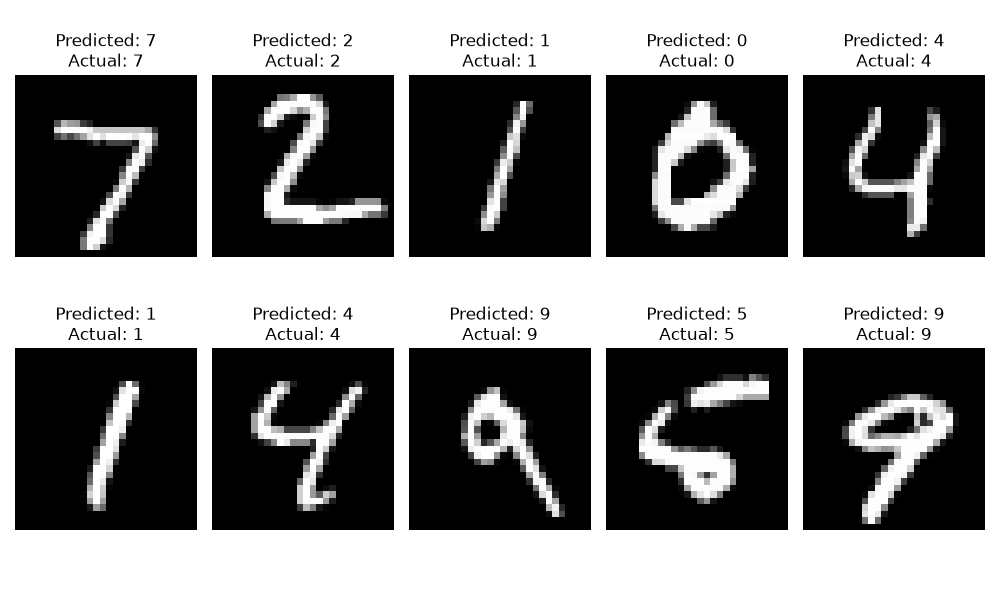
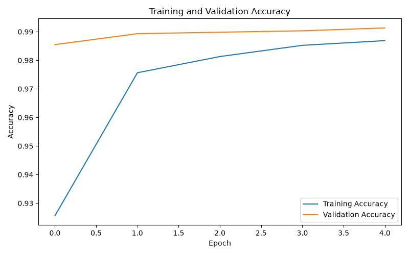
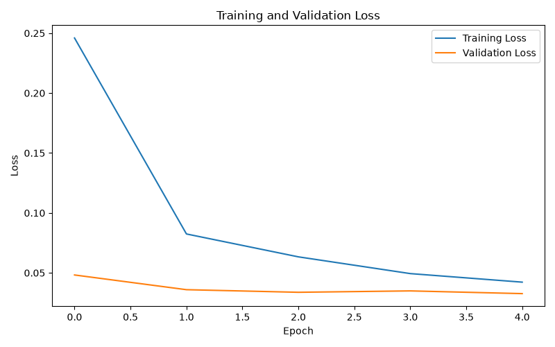

# Handwritten Character Recognition Using CNN

## Project Overview

This project is a Handwritten Character Recognition system developed using Deep Learning and Convolutional Neural Networks (CNN).

The model is trained on the MNIST handwritten digit dataset and learns to recognize handwritten digits from 0 to 9.

The project was developed as part of the CodeAlpha Machine Learning Internship.

## Objective

The main objective of this project is to build a deep learning model that can accurately identify handwritten digits from image data.

## Dataset

The project uses the MNIST dataset provided through TensorFlow/Keras.

Dataset details:

- Training images: 60,000
- Testing images: 10,000
- Image size: 28 × 28 pixels
- Image type: Grayscale
- Number of classes: 10
- Classes: Digits 0 to 9

## Technologies Used

- Python
- TensorFlow
- Keras
- Convolutional Neural Network (CNN)
- Matplotlib
- MNIST Dataset

## Data Preprocessing

The following preprocessing steps were performed:

1. Loaded the MNIST dataset.
2. Converted pixel values to floating-point numbers.
3. Normalized pixel values from 0–255 to 0–1.
4. Reshaped the images to the format required by the CNN:
   28 × 28 × 1.

## CNN Architecture

The model consists of the following layers:

1. Input Layer
2. Convolutional Layer with 32 filters
3. Max Pooling Layer
4. Convolutional Layer with 64 filters
5. Max Pooling Layer
6. Flatten Layer
7. Dense Layer with 128 neurons
8. Dropout Layer
9. Output Layer with 10 neurons

The output layer uses the Softmax activation function to classify the image into one of the 10 digit classes.

## Model Training

The model was trained using:

- Optimizer: Adam
- Loss Function: Sparse Categorical Crossentropy
- Batch Size: 64
- Epochs: 5
- Validation Split: 10%

## Model Performance

The trained CNN achieved:

| Metric | Result |
|---|---:|
| Test Accuracy | 99.21% |
| Test Loss | 0.0234 |

The model successfully recognized the handwritten digits in the MNIST test dataset.

## Results

The project generates the following visualizations:

### Sample Predictions

The model predicts handwritten digits and compares them with their actual labels.



### Training and Validation Accuracy

This graph shows the accuracy of the model during training and validation.



### Training and Validation Loss

This graph shows the training and validation loss across the training epochs.



## Project Structure

```text
CodeAlpha_HandwrittenCharacterRecognition
│
├── results
│   ├── sample_predictions.png
│   ├── accuracy_graph.png
│   └── loss_graph.png
│
├── handwritten_recognition.py
├── handwritten_digit_cnn.keras
├── requirements.txt
├── .gitignore
└── README.md